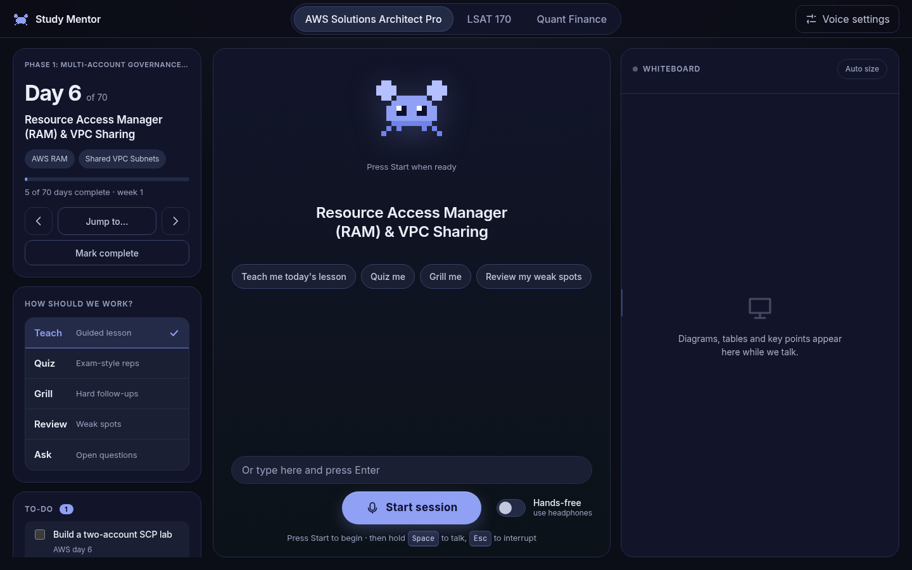

# Study Mentor: open-source AI voice tutor

[](LICENSE)  

A free, self-hosted AI voice tutor with a live Mermaid whiteboard. You talk to it, it talks back, quizzes you, and draws the idea as it explains. Built for AWS Solutions Architect Professional (SAP-C02), LSAT and quant finance prep, and easy to point at any curriculum you provide.



**Website:** https://stanley-n.com/study-mentor/ ·  Keywords: AI tutor, voice assistant, study app, SAP-C02, LSAT, quant interview, Kokoro TTS, faster-whisper, DeepSeek, FastAPI, Mermaid.

## What it does

Study Mentor is a private voice tutor that speaks with you in real time. It does not read pages aloud. It explains concepts in its own words, asks you questions, pushes back when you are vague, and keeps track of what you keep missing.

It runs entirely on your machine except for the text sent to a language model API of your choice. The interface is a dark, local web app with a pixel crab mentor, live captions, a resizable whiteboard, and hands-free voice interaction.

## Features

- Voice-first tutoring with speech recognition, text to speech, and streaming language model responses
- Explain-first teaching for beginners: it teaches an idea in plain words, then checks you, instead of quizzing from the first minute
- A five-rung mastery ladder (taught, recognises, applies, exam-style, professional) tracked per skill, with spaced review: skills come back after 12 hours, 1, 3, 7 and 21 days depending on rung
- An independent grader scores your answers in code, separate from the mentor, so praise and corrections are honest; misses need a verbatim quote from the lesson to count
- Server-owned practice items (hundreds of generated exam-style questions with named distractor traps) graded in code, including review items for skills that are due
- Coverage tracking: a day only completes after every section is taught; whatever you skipped or got wrong carries forward to the next session
- A persistent homework list: the mentor adds detailed tasks, they stay until you tick them, oldest first
- Session debriefs and warm-ups: each session opens by recalling what you got wrong last time
- An errata file for correcting known mistakes in your own lesson material, plus a background fact checker
- Evaluation harness (`evals/`): simulated students (passive, struggling, curious, overconfident), multi-day chains and a scoring rubric, used to measure teaching quality
- Multiple study modes: Teach, Quiz, Grill, Review, and Ask
- A whiteboard where the mentor draws tables, key points, and Mermaid diagrams, highlighting each node as it explains
- Stage-by-stage whiteboard walkthroughs with auto-resizing layouts (wide, normal, rail)
- Progress tracking in a local SQLite database: days done, weak topics, session notes
- A streak counter and weak topic list on the home screen
- Push-to-talk, hands-free mode, and typed input
- Optional desktop reminder widget: a pixel crab walks onto your screen at scheduled study times
- Local curriculum loading from folders you provide

## How it works

Study Mentor is a FastAPI server that streams audio and whiteboard updates to a browser over WebSocket. Speech is transcribed locally with faster-whisper. The transcript is sent to an OpenAI-compatible chat API. The model's response is parsed for hidden tags that control the whiteboard, layout, and progress logging. Sentences are split and sent to Kokoro for text to speech.

```
Browser (mic, audio queue, whiteboard)
        <-> FastAPI WebSocket
        <-> tutor (prompt, DeepSeek stream, tag parser, sentence splitter)
        -> Kokoro TTS -> browser
/api/stt -> faster-whisper
SQLite progress
```

The model can emit hidden tags that are never spoken: `board`, `focus`, `layout`, `log`, `covered`, `todo`, `calc`, `day_done`, `note`. These control the whiteboard, record progress and coverage, add homework, run exact arithmetic on the server, mark a day complete, or save a session note. Grading, item selection, spaced review and coverage rules run in code, not in the prompt, so the model cannot talk its way past them.

## Requirements

- Python 3.10 or newer
- Node.js (needed to read week-based checklist files)
- A Chromium-based browser for the app window (microphone permission required)
- A language model API key (DeepSeek by default, any OpenAI-compatible endpoint works)
- Kokoro model files downloaded separately (see Quick start)
- Linux with KDE Plasma for the desktop reminder widget (the Python server itself is cross-platform in principle)

## Quick start

```bash
git clone https://github.com/consultantstanleymn/study-mentor.git
cd study-mentor

python -m venv venv
venv/bin/pip install fastapi "uvicorn[standard]" httpx beautifulsoup4 lxml faster-whisper numpy soundfile kokoro-onnx python-multipart PySide6-Essentials

mkdir -p ~/.local/share/study-mentor/tts
# Download kokoro-v1.0.onnx and voices-v1.0.bin into ~/.local/share/study-mentor/tts
# See: https://github.com/thewh1teagle/kokoro-onnx

mkdir -p ~/.config/study-mentor
echo "YOUR_KEY" > ~/.config/study-mentor/deepseek.key

./run.sh
```

Open http://127.0.0.1:8765 in a Chromium-based browser and allow microphone access.

## Configuration

Set these environment variables before running, or export them in your shell profile.

| Variable | Default | Description |
|---|---|---|
| `MENTOR_API_KEY` | unset | API key for the language model. If unset, the key is read from `MENTOR_KEY_FILE`. |
| `MENTOR_KEY_FILE` | `~/.config/study-mentor/deepseek.key` | Path to a file containing the API key. |
| `MENTOR_API_URL` | `https://api.deepseek.com/chat/completions` | OpenAI-compatible chat completions endpoint. |
| `MENTOR_MODEL` | `deepseek-v4-pro` | Model name to request from the API. |
| `MENTOR_WHISPER` | `base.en` | faster-whisper model. Use `small.en` for better accuracy at the cost of speed. |
| `MENTOR_KOKORO_DIR` | `~/.local/share/study-mentor/tts` | Directory containing `kokoro-v1.0.onnx` and `voices-v1.0.bin`. |

Available Kokoro voices include `bm_george`, `bm_lewis`, and `bf_emma`. The voice is configurable in the app's Voice settings.

## Adding your own curriculum

Curricula live in folders under `content/` and are registered in `server/content.py` in the `TRACKS` dictionary. This repository does not include any curriculum content. You bring your own.

Two layouts are supported:

**Day-based**

A folder containing `data/days.json` plus `days/day-NNN.html` pages. Each HTML page uses `.doc-section` sections for content and `.scenario-card` elements for quiz cards.

**Week-based**

A folder containing a `checklist-data.js` file that defines a `MONTHS` array with weeks, categories, and tasks. Node.js is used to read this file.

The author uses Study Mentor for AWS Solutions Architect Professional, LSAT, and a quant finance checklist.

## Using it

**Keyboard shortcuts**

| Key | Action |
|---|---|
| Space (hold) | Push to talk |
| Esc | Interrupt the mentor |
| Type in the input box | Send a text message |

**Modes**

- **Teach**: the mentor explains a topic in its own words
- **Quiz**: the mentor asks questions and checks your answers
- **Grill**: rapid-fire follow-up questions that dig into weak spots
- **Review**: revisit topics you have missed
- **Ask**: free-form questions about the material

**Whiteboard**

The mentor draws on the right side of the screen. You can drag the splitter to resize it, or toggle Auto size to let the model choose wide, normal, or rail layouts.

**Hands-free mode**

Turn on the Hands-free switch next to the microphone button and use headphones. The mentor listens continuously and responds when you speak.

**Desktop reminders**

The optional widget at `widget/crab_widget.py` uses PySide6. A pixel crab walks onto your screen at scheduled study times, speaks a line, and offers Start, 10 more minutes, or Not today. The schedule file is at `~/.config/study-mentor/schedule.json` and can be edited from Voice settings in the app.

An optional systemd user service is available for auto start.

## Privacy

Progress data (days done, mastery levels, homework, coverage, session notes) is stored in a local SQLite file at `data/mentor.db`. Nothing leaves your machine except the text sent to the language model API you configure. Audio is transcribed locally and never uploaded.

## Troubleshooting

**Microphone blocked**

Check the browser address bar for a blocked microphone icon. You must serve the app from `http://127.0.0.1:8765` and grant permission. Browsers only allow the microphone on localhost or HTTPS pages.

**No sound**

Verify that `MENTOR_KOKORO_DIR` points to a directory containing both `kokoro-v1.0.onnx` and `voices-v1.0.bin`. Check the server logs for Kokoro loading errors.

**Slow transcription**

The default `base.en` model is fast but less accurate. Set `MENTOR_WHISPER=small.en` for better accuracy. Transcription runs on CPU, so a faster machine helps.

**Model errors**

Check that `MENTOR_API_KEY` is set or that `MENTOR_KEY_FILE` points to a file containing your key. Verify `MENTOR_API_URL` and `MENTOR_MODEL` match your provider's API.

## Evaluating the teaching

`evals/` contains a simulator that plays a student against the real tutor in a throwaway database. `evals/run_iter.sh N` runs four standard sessions, `evals/sim_multi.py` runs a multi-day chain with a simulated clock, and `evals/RUBRIC.md` lists the ten criteria used to score a run. Set `MENTOR_DB` to point the server at a different database file.

## Roadmap

- Timed mixed practice sets, weekly professional-level (L4) tasks and mock-exam score logging that re-plans weak skills
- Vision input: let the mentor see diagrams or screenshots you share
- More Kokoro voices and voice quality options
- Additional whiteboard rendering formats

## Third-party software

Bundled in `static/vendor/`: [Mermaid](https://github.com/mermaid-js/mermaid) (MIT), [marked](https://github.com/markedjs/marked) (MIT) and [DOMPurify](https://github.com/cure53/DOMPurify) (Apache-2.0 or MPL-2.0). Speech uses [faster-whisper](https://github.com/SYSTRAN/faster-whisper) and [kokoro-onnx](https://github.com/thewh1teagle/kokoro-onnx).

## License and credits

Copyright (c) 2026 Stanley Sujith Nelavala

MIT License. See `LICENSE` for the full text.

Author: Stanley Sujith Nelavala  
GitHub: [consultantstanleymn](https://github.com/consultantstanleymn)
